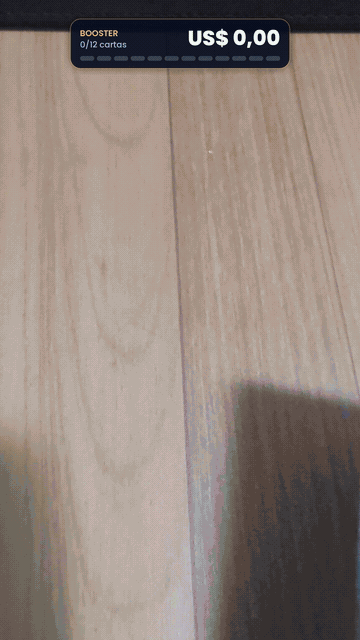
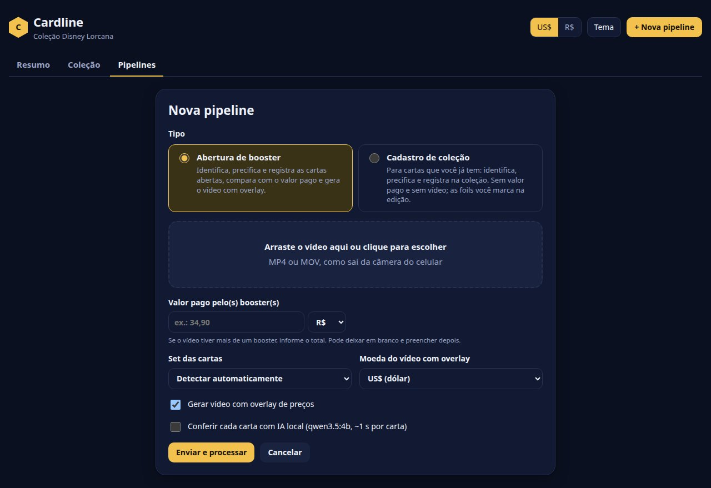
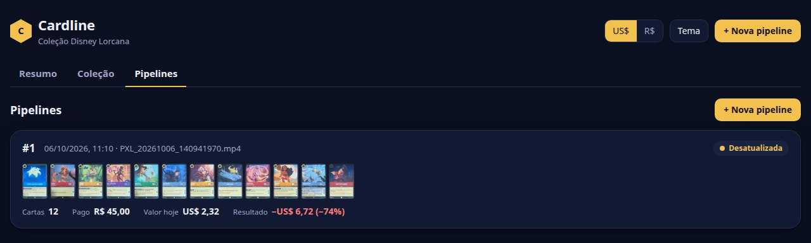
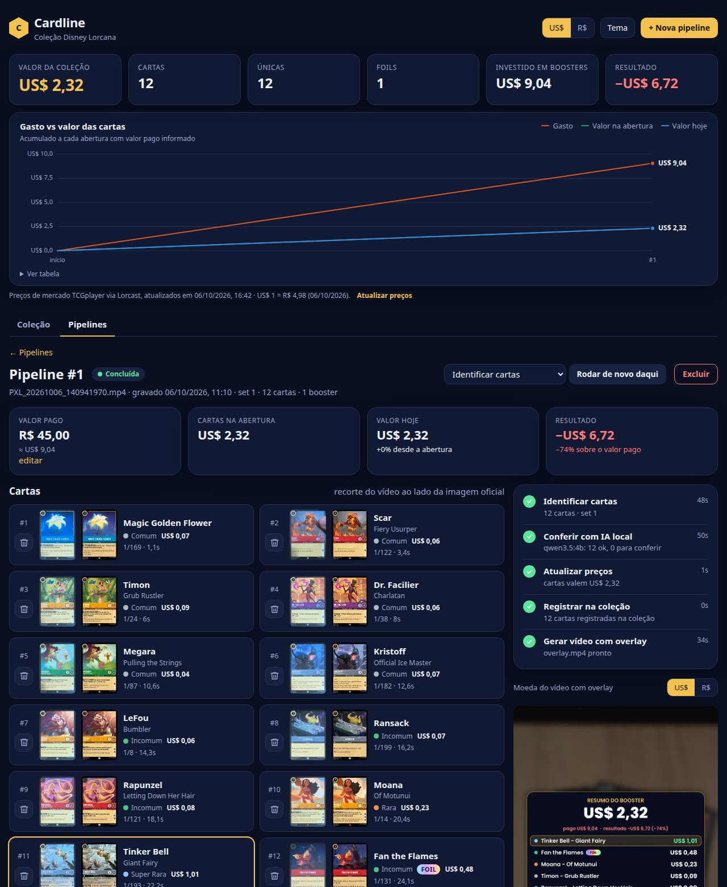
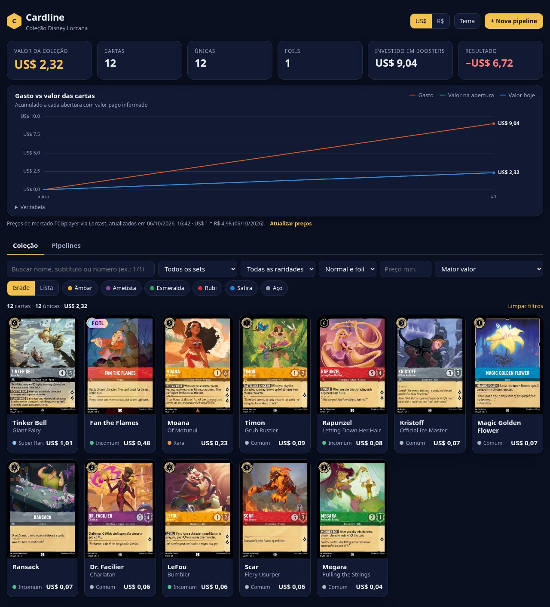
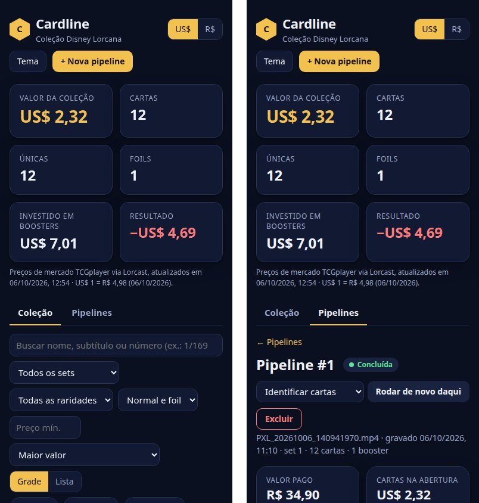

# Cardline
Pipeline de cartas, abra seu booster e acompanhe o resultado.

Começando por **Disney Lorcana**: você envia o vídeo abrindo o booster e o cardline

1. identifica cada carta revelada e o instante em que ela aparece;
2. busca o preço de mercado atual (TCGplayer, via [Lorcast](https://lorcast.com));
3. registra as cartas na sua coleção, vinculadas à pipeline que as abriu;
4. compara com o valor pago pelo booster (resultado da abertura);
5. renderiza o vídeo de volta com overlay: preço de cada carta quando ela aparece e o total do booster somando.

<p align="center">
  
</p>
<p align="center"><sub>Vídeo de exemplo processado pelo cardline (acelerado; o valor pago no resumo é ilustrativo).</sub></p>

## Instalação

Requer [uv](https://docs.astral.sh/uv/). O ffmpeg vem embutido (imageio-ffmpeg), não precisa instalar.

```bash
uv sync
uv run cardline sync          # catálogo + preços + imagens + índices (~2 min na primeira vez, ~500 MB em data/cache)
```

`uv run cardline sync --sets 1,2` indexa só os sets que você abre. Os preços das cartas de cada pipeline
são atualizados no próprio passo de preços, então o `sync` só precisa rodar de novo quando sair um set novo.

## Uso

```bash
uv run cardline serve         # abre a página em http://localhost:8000
```

Sem a página, pelo terminal: `uv run cardline process videos/abertura.mp4 --paid 34.90` (e `cardline list`).

### Como gravar

O formato do vídeo de exemplo funciona bem: câmera de cima, cartas colocadas **uma por vez numa pilha**,
cada uma parada por ~1 s. Luz boa e sem reflexo forte ajudam. Pode abrir vários boosters no mesmo vídeo
(agrupados de `pack_size` em `pack_size` cartas). O set é detectado sozinho, ou pode ser escolhido no upload.

## Página web

A página fica em `cardline/web/` (HTML, CSS e JavaScript puros, sem build) e é servida pelo
`cardline/server.py` (FastAPI). O mesmo servidor expõe a API, recebe os uploads e roda as pipelines em fila,
uma por vez, cada uma num processo próprio.

No topo da página ficam o valor da coleção, o total investido em boosters e o resultado, o seletor
US$/R$ (pela cotação do dia) e o tema claro/escuro. Logo abaixo, o gráfico **Gasto vs valor das cartas**
acumula, abertura por abertura, quanto foi pago e quanto as cartas valiam na abertura e valem hoje. O
gráfico tem tooltip (também pelo teclado, com as setas) e uma tabela com os mesmos números em "Ver tabela".

**Atualizar preços**, ao lado da data dos preços, busca os preços de mercado de hoje das cartas da
coleção. O valor de cada carta **no momento da abertura** fica guardado e não muda, nem com esse botão
nem ao reprocessar uma pipeline. É ele que aparece no vídeo e em "Na abertura".

As capturas abaixo são do booster de exemplo.

### Nova pipeline



1. Clique em **+ Nova pipeline** e arraste o vídeo da abertura (MP4 ou MOV, do jeito que sai do celular).
2. Informe o **valor pago** pelo(s) booster(s), em R$ ou US$. É opcional e pode ser preenchido depois.
3. **Set dos boosters**: deixe em "Detectar automaticamente" ou escolha o set.
4. Escolha a **moeda do vídeo com overlay** e se quer gerar o vídeo.
5. **Conferir com IA local** só fica habilitado com o Ollama rodando. Com `verify_model` no
   `cardline.toml`, ele já vem marcado.
6. **Enviar e processar**: a barra mostra o envio. Ao terminar, a página abre a pipeline e acompanha o
   progresso sozinha.

Um vídeo que já foi processado é recusado, com um link para a pipeline original.

### Pipelines



A lista mostra cada abertura com o status (na fila, rodando, concluída, falhou, interrompida ou
desatualizada), o progresso ao vivo, as miniaturas das cartas, o valor pago, o valor de hoje e o resultado.



No detalhe de uma pipeline:

- **Valor pago** (com "editar"), **cartas na abertura**, **valor hoje** e **resultado** sobre o valor pago.
- **Cartas**: o recorte tirado do vídeo ao lado da imagem oficial, para conferir a identificação. A melhor
  carta fica destacada, e ⚠ marca uma divergência apontada pela IA local. Clicar abre os detalhes da carta.
- **Corrigir cartas**: a lixeira em cada carta tira uma carta identificada errada ou duplicada, e ela vai
  para "Removidas", de onde pode ser restaurada. As edições ficam pendentes até você clicar
  **Reprocessar com as edições**, no fim da lista: aí preços, coleção e vídeo são refeitos sem as cartas
  removidas, e a dedução da foil é refeita para a nova composição do booster.
- **Passos** com status, mensagem e tempo de cada um. O passo em andamento mostra a barra de progresso.
- **Vídeo com overlay** para assistir ou baixar, e o **log** da execução. A **moeda do vídeo** (US$ ou R$)
  pode ser trocada acima do player; o vídeo é refeito ao reprocessar.
- Ações: **Continuar** (depois de falha ou interrupção), **Rodar de novo daqui** (a partir de qualquer passo)
  e **Excluir** (remove a pipeline e as cartas que ela registrou na coleção).

### Coleção



Busca por nome, subtítulo ou número (`1/169`), filtros por set, raridade, tinta, foil e preço mínimo,
várias ordenações, e visualização em grade ou lista. Clicar numa carta abre a imagem grande, os preços normal e
foil, o link do TCGplayer e cada cópia: de qual pipeline veio (com link) e quanto valia na abertura e hoje.

### No celular e acesso remoto



A página funciona no celular. Por padrão o servidor só aceita conexões da própria máquina. Para acessar de
outro aparelho:

- na rede local: `uv run cardline serve --host 0.0.0.0` e abra `http://IP-da-máquina:8000`;
- de qualquer lugar: um túnel, por exemplo `ngrok http 8000 --basic-auth "usuario:uma-senha-forte"`.

A página não tem login: quem tiver o endereço consegue enviar vídeos, rodar e excluir pipelines. Use senha
no túnel, ou só redes de confiança.

### API

| Método | Rota | Para quê |
|---|---|---|
| GET | `/api/meta` | moedas e cotação, passos, sets, raridades e se o Ollama está disponível |
| GET | `/api/collection` | cartas da coleção, agrupadas por carta e acabamento, com as cópias |
| GET | `/api/runs` | pipelines com status, progresso e valores |
| GET | `/api/runs/{id}` | detalhe: passos, cartas e log |
| POST | `/api/runs?filename=…&paid=…&paid_currency=BRL` | cria a pipeline; o corpo da requisição é o vídeo |
| POST | `/api/runs/{id}/rerun` | `{"from_step": "prices"}`, ou `null` para continuar de onde parou |
| PATCH | `/api/runs/{id}` | `{"paid": 34.9, "paid_currency": "BRL"}` e/ou `{"currency": "BRL"}` (moeda do vídeo); só o que for enviado muda |
| POST | `/api/prices/refresh` | atualiza os preços de hoje dos sets da coleção (o preço na abertura não muda) |
| DELETE | `/api/runs/{id}/cards/{uid}` | tira uma carta da identificação (fica pendente até reprocessar) |
| POST | `/api/runs/{id}/cards/{uid}/restore` | devolve uma carta removida |
| DELETE | `/api/runs/{id}` | exclui a pipeline e as cartas dela |

## Pipeline

### Passos

| Passo | Faz | Artefato em `runs/<id>/` |
|---|---|---|
| Identificar cartas | casa os frames com as imagens oficiais e acha quando cada carta aparece | `scan.json`, `crops/` |
| Conferir com IA local | (opcional) um modelo de visão do Ollama lê nome e número de cada recorte | `scan.json` |
| Atualizar preços | busca os preços de hoje do set e fixa o preço da abertura de cada carta (foil ou não); ao reprocessar, o preço da abertura é mantido, e uma carta nova recebe o preço do dia da abertura | `scan.json` |
| Registrar na coleção | substitui as cartas que esta pipeline tinha registrado | banco |
| Gerar vídeo com overlay | vídeo 1080×1920 com etiquetas, total animado e resumo (com valor pago e resultado) | `overlay.mp4`, `overlay.jpg` |

Cada passo grava seu estado. Se algo falhar ou o servidor cair, a pipeline pode **continuar de onde parou**,
e qualquer pipeline pode **rodar de novo a partir de um passo** (na página ou com `cardline run ID --from passo`).

### Correções

Na página, a lixeira de cada carta resolve cartas erradas ou duplicadas. Pelo terminal dá para fazer
também, e mais (trocar a carta, marcar foil, inserir uma que faltou):

```bash
uv run cardline edit 4 3 --card 1/24          # na pipeline 4, a carta #3 é a 1/24 (também aceita nome)
uv run cardline edit 4 12 --foil              # a #12 é foil (--no-foil desfaz)
uv run cardline edit 4 5 --remove             # a #5 não é uma carta aberta
uv run cardline edit 4 --card 1/55 --at 9.2   # faltou uma carta aos 9,2 s
```

A correção muda só o resultado da identificação. Preço, coleção e vídeo ficam marcados como
desatualizados até você clicar **Reprocessar com as edições** na página (ou rodar `cardline run 4`). Aí só esses passos
rodam de novo, e as cartas registradas na coleção mudam junto.

Cartas obtidas fora de vídeo: `uv run cardline add 1/169 --foil --qty 2`.

## Configuração

`cardline.toml` (todas as chaves são opcionais e estão documentadas no arquivo): moeda padrão do vídeo
(`USD` ou `BRL`), cartas por booster, fps da análise, resolução de saída, duração do resumo, e o modelo do
Ollama para conferência. Com `verify_model` preenchido, a opção já vem marcada no upload.

## Como funciona

- **Identificação** (`index.py`, `matcher.py`): as imagens oficiais de cada set viram um índice de features
  SIFT. A arte tem um orçamento próprio de features, porque as mais fortes de uma carta ficam no texto,
  que usa a mesma fonte em todas as cartas. Cada frame (10 fps) é casado contra o índice com FLANN, teste
  de razão e votação por carta, e o resultado é verificado por homografia (RANSAC). A homografia diz *qual*
  carta é e *onde* ela está, e é dela que saem o recorte retificado e a posição da etiqueta no overlay.
- **Segmentação** (`scan.py`): a carta com mais pontos casados é a do topo da pilha. Cada sequência estável
  de uma nova carta no topo é uma carta revelada.
- **Foil** (`foil.py`): o brilho foil não é confiável no vídeo, então ele é inferido pela estrutura do booster.
  Um booster tem 6 comuns, 3 incomuns, 2 raras+ e 1 foil. A classe de raridade que sobra contém a foil, e
  ela fica na ponta do booster. Enchanted, Epic e Iconic são sempre foil.
- **Pipeline** (`pipeline.py`): passos com estado no banco (`runs`, `run_steps`) e artefatos na pasta do run.
  O servidor (`server.py`, FastAPI) roda uma pipeline por vez, cada uma num processo próprio
  (`cardline run ID`), e a página acompanha o progresso por polling.
- **Overlay** (`overlay.py`): o ffmpeg decodifica (com tone mapping HDR→SDR para os vídeos HLG do Pixel), o
  Pillow desenha e o x264 codifica mantendo o áudio original.
- **Conferência com IA local** (`verify.py`): no vídeo de exemplo o `qwen3.5:4b` acertou 12/12 nomes e
  números (~1 s por carta). Ele só **sinaliza** divergências, nunca troca a carta, porque pode alucinar.

## Dados

- `data/cardline.db`: catálogo, preços, pipelines e **a sua coleção**. Fica fora do git (o repositório é
  público e o banco muda a cada atualização de preço), então faça backup desse arquivo.
- `runs/<id>/`: vídeo enviado, recortes, `scan.json`, `overlay.mp4` (+ capa `overlay.jpg`) e `pipeline.log` de cada pipeline.
- `data/cache/`: imagens e índices, regeneráveis com `cardline sync`.

## Testes

```bash
uv run pytest
```
