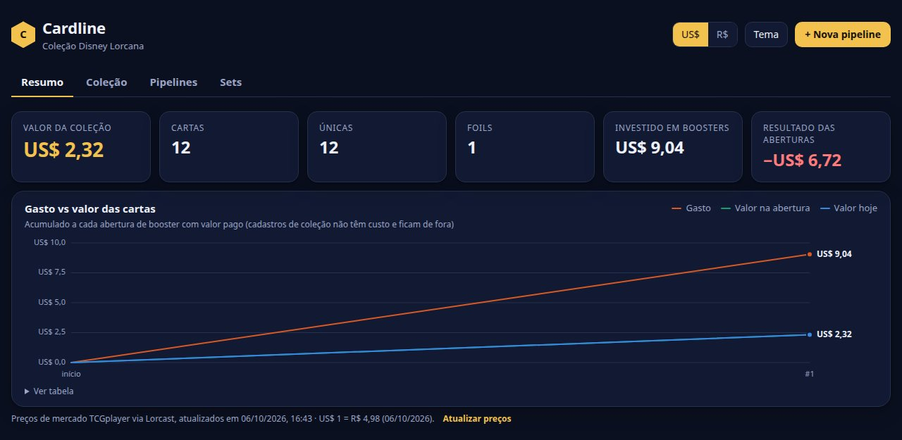
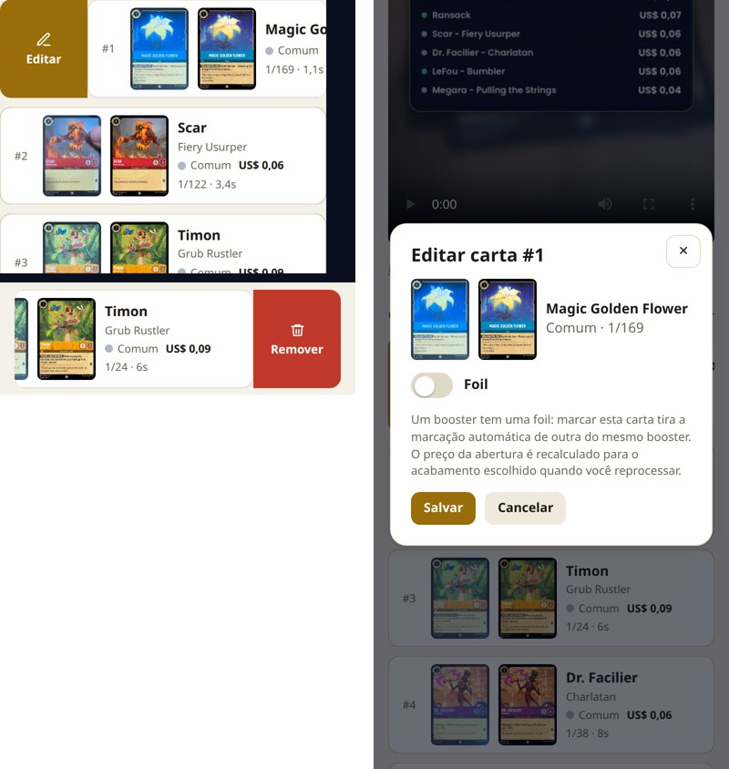
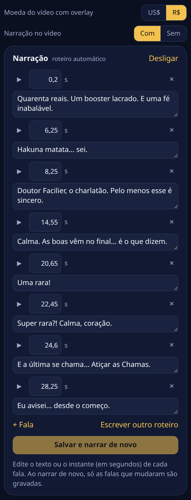
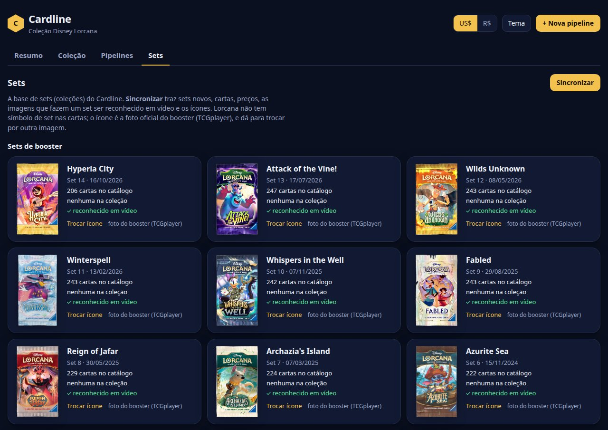

# Cardline
Pipeline de cartas, abra seu booster e acompanhe o resultado.

Começando por **Disney Lorcana**: você envia o vídeo abrindo o booster e o cardline

1. identifica cada carta revelada e o instante em que ela aparece;
2. busca o preço de mercado atual (TCGplayer, via [Lorcast](https://lorcast.com));
3. registra as cartas na sua coleção, vinculadas à pipeline que as abriu;
4. compara com o valor pago pelo booster (resultado da abertura);
5. renderiza o vídeo de volta com overlay: uma capa com o booster e o valor pago, o preço de cada carta quando
   ela aparece e o total do booster somando, num painel com o ícone do set;
6. (opcional) narra o vídeo: um narrador de trailer comenta a abertura sem dar spoiler, com voz em português;
7. (opcional) posta no YouTube e acompanha visualizações e reações de cada abertura.

Também dá para **cadastrar cartas que você já tem**: grave as cartas uma por uma e o cardline identifica,
precifica e registra na coleção, sem valor pago e sem vídeo de saída.

<p align="center">
  
</p>
<p align="center"><sub>Vídeo de exemplo processado pelo cardline (as cartas aceleradas; o valor pago é ilustrativo).</sub></p>

## Instalação

Requer [uv](https://docs.astral.sh/uv/). O ffmpeg vem embutido (imageio-ffmpeg), não precisa instalar.

```bash
uv sync
uv run cardline sync          # catálogo + preços + imagens + índices (~2 min na primeira vez, ~500 MB em data/cache)
```

Para a **narração** (opcional), instale o extra da voz. Ele é pesado: torch (só CPU) e, na primeira narração,
a voz XTTS-v2 (1,9 GB), que usa a [licença CPML](https://coqui.ai/cpml), só para uso não comercial:

```bash
uv sync --extra narracao
COQUI_TOS_AGREED=1 uv run cardline voz   # aceita a licença, baixa a voz e lista as 58 vozes disponíveis
```

Depois disso, rode sempre `uv sync --extra narracao`: um `uv sync` sem o extra desinstala a voz.
`uv run cardline voz --amostras` grava uma amostra de cada voz (~6 min), para ouvir e escolher na página. As piadas do
roteiro são escritas por um modelo do Ollama (`gemma3:4b` por padrão); sem Ollama, o roteiro sai sem elas.

`uv run cardline sync --sets 1,2` indexa só os sets que você abre. Os preços das cartas de cada pipeline
são atualizados no próprio passo de preços, então o `sync` só precisa rodar de novo quando sair um set novo
(também dá pela página: botão **Sincronizar** na aba **Sets**).

## Uso

```bash
uv run cardline serve         # abre a página em http://localhost:8000
```

Sem a página, pelo terminal: `uv run cardline process videos/abertura.mp4 --paid 34.90` para uma abertura,
`uv run cardline process videos/colecao.mp4 --cadastro` para um cadastro, e `cardline list` para ver as pipelines.

### Como gravar

O formato do vídeo de exemplo funciona bem: câmera de cima, cartas colocadas **uma por vez numa pilha**,
cada uma parada por ~1 s. Luz boa e sem reflexo forte ajudam. Pode abrir vários boosters no mesmo vídeo
(agrupados de `pack_size` em `pack_size` cartas). O set é detectado sozinho, ou pode ser escolhido no upload.

## Página web

A página fica em `cardline/web/` (HTML, CSS e JavaScript puros, sem build) e é servida pelo
`cardline/server.py` (FastAPI). O mesmo servidor expõe a API, recebe os uploads e roda as pipelines em fila,
uma por vez, cada uma num processo próprio.

A página tem quatro abas: **Resumo** (onde ela abre), **Coleção**, **Pipelines** e **Sets**. No topo ficam sempre o
seletor US$/R$ (pela cotação do dia), o tema claro/escuro e o botão **+ Nova pipeline**. As capturas
abaixo são do booster de exemplo.

### Resumo



O valor da coleção (somando tudo, com o detalhe de quanto vem de aberturas, de cadastros e de cartas avulsas),
o total investido em boosters e o resultado das aberturas. O gráfico **Gasto vs valor das cartas** acumula,
abertura por abertura, quanto foi pago e quanto as cartas valiam na abertura e valem hoje. Ele tem tooltip
(também pelo teclado, com as setas) e uma tabela com os mesmos números em "Ver tabela".

Cadastros de coleção **não entram** no investido, no resultado nem no gráfico: são cartas que você já tinha,
sem custo, e entrariam como valor sem gasto, inflando o resultado das aberturas.

**Atualizar preços**, ao lado da data dos preços, busca os preços de mercado de hoje das cartas da
coleção. O valor de cada carta **no momento da abertura** fica guardado e não muda, nem com esse botão
nem ao reprocessar uma pipeline. É ele que aparece no vídeo e em "Na abertura".

### Nova pipeline


1. Clique em **+ Nova pipeline** e escolha o tipo:
   - **Abertura de booster**: identifica, precifica e registra as cartas abertas, compara com o valor pago e
     gera o vídeo com overlay.
   - **Cadastro de coleção**: para cartas que você já tem. Identifica, precifica e registra na coleção, sem
     valor pago e sem vídeo. Como não há booster, a foil não é deduzida: marque as foils pela edição.
2. Arraste o vídeo (MP4 ou MOV, do jeito que sai do celular).
3. Na abertura, informe o **valor pago** pelo(s) booster(s), em R$ ou US$. É opcional e pode ser preenchido depois.
4. **Set das cartas**: deixe em "Detectar automaticamente" ou escolha o set. Na abertura, escolha também a
   **moeda do vídeo com overlay**, se quer gerar o vídeo e se quer **narrar o vídeo** (precisa do extra
   `narracao`; ~2 min a mais).
5. **Conferir com IA local** só fica habilitado com o Ollama rodando. Com `verify_model` no
   `cardline.toml`, ele já vem marcado.
6. **Enviar e processar** (ou **Enviar e cadastrar**): a barra mostra o envio. Ao terminar, a página abre a
   pipeline e acompanha o progresso sozinha.

Um vídeo que já foi processado é recusado, com um link para a pipeline original.

### Pipelines


A lista mostra cada pipeline com o tipo, o status (na fila, rodando, concluída, falhou, interrompida ou
desatualizada), o progresso ao vivo, as miniaturas das cartas e os valores: pago, hoje e resultado numa
abertura; no cadastro e hoje num cadastro. O filtro no topo separa **Todas**, **Aberturas** e **Cadastros**.
O detalhe de um cadastro tem o mesmo editar/remover por deslize e o mesmo reprocessar, mas sem vídeo.


No detalhe de uma pipeline:

- **Valor pago** (com "editar"), **cartas na abertura**, **valor hoje** e **resultado** sobre o valor pago.
- **Cartas**: o recorte tirado do vídeo ao lado da imagem oficial, para conferir a identificação. A melhor
  carta fica destacada, e ⚠ marca uma divergência apontada pela IA local. Clicar abre os detalhes da carta.
- **Corrigir cartas**: deslize a carta para a **direita** para **Editar** ou para a **esquerda** para
  **Remover** (com o mouse, clique e arraste; pelo teclado, Tab chega nos dois botões).
  - **Editar** abre a carta com a chave **Foil**. Como um booster tem uma foil, marcar uma carta tira a
    marcação que o sistema tinha deduzido em outra do mesmo booster. Encantada, Épica e Icônica são sempre foil.
  - **Remover** tira uma carta identificada errada ou duplicada; ela vai para "Removidas", de onde pode ser
    restaurada.
  - As edições ficam pendentes até **Reprocessar com as edições**, no fim da lista: preços, coleção e vídeo
    são refeitos. Cartas que não mudaram mantêm o preço da abertura, e uma carta que mudou de acabamento recebe
    o preço daquele acabamento no dia da abertura.

  
- **Passos** com status, mensagem e tempo de cada um. O passo em andamento mostra a barra de progresso.
- **Vídeo com overlay** para assistir ou baixar, e o **log** da execução. A **moeda do vídeo** (US$ ou R$)
  pode ser trocada acima do player; o vídeo é refeito ao reprocessar. Com narração, **Com/Sem** escolhe a versão.
- **Narração**: **Narrar este vídeo** liga a narração numa pipeline já feita. O painel tem a **voz** (as 58 do
  XTTS-v2, agrupadas em graves, médias e agudas pelo tom; ▶ toca uma amostra) e o roteiro, e
  cada fala pode ser editada no texto e no instante (▶ leva o vídeo àquele momento), apagada ou criada (**+ Fala**).
  **Salvar e narrar de novo** grava de novo só as falas que mudaram; **Escrever outro roteiro** troca por um
  novo; **Desligar** apaga o vídeo narrado (as falas gravadas ficam guardadas).

  
- Ações: **Continuar** (depois de falha ou interrupção), **Rodar de novo daqui** (a partir de qualquer passo)
  e **Excluir** (remove a pipeline e as cartas que ela registrou na coleção).

### Coleção


Busca por nome, subtítulo ou número (`1/169`), filtros por set, raridade, tinta, foil e preço mínimo,
várias ordenações, e visualização em grade ou lista. Clicar numa carta abre a imagem grande, os preços normal e
foil, o link do TCGplayer e cada cópia: de qual pipeline veio (com link) e quanto valia na abertura e hoje.

### Sets



A base de sets que o cardline conhece. Cada set mostra o ícone, a data de lançamento, quantas cartas tem no
catálogo e na sua coleção, e se já é **reconhecido em vídeo** (imagens baixadas e índice pronto). As cartas de
Lorcana não têm símbolo de expansão (o símbolo embaixo é a raridade), então o ícone de cada set é a **foto
oficial do booster** no TCGplayer, com o fundo branco removido. Sets sem booster avulso (promos, quests)
ficam com um selo hexagonal com o código do set.

- **Sincronizar** roda o `cardline sync` em segundo plano: sets novos, cartas, preços, imagens, índices e
  ícones. Saiu um set novo, é só clicar; a página mostra o andamento e se atualiza no fim.
- **Trocar ícone** põe uma imagem sua (o logo do set, por exemplo) no lugar da foto do booster. A
  sincronização não troca um ícone escolhido por você, e **Usar a foto do booster** desfaz a troca.

O ícone aparece na capa e no painel do vídeo que vai somando o booster, na lista e no detalhe das pipelines e no
detalhe de cada carta. A foto é guardada em resolução cheia (até 1000 px) para a capa, e a página usa uma
miniatura leve; ícones guardados pela versão anterior, menores, são baixados de novo na próxima sincronização.

### YouTube

O vídeo de uma abertura pode ir para o seu canal, e o **Resumo** ganha o gráfico **visualizações e reações
por abertura**: visualizações num gráfico, curtidas e comentários no outro, e embaixo de cada abertura o
resultado do booster, para ver se booster ruim rende mais (ou menos) views.

**Configuração (uma vez):**

1. No [Google Cloud](https://console.cloud.google.com), crie um projeto e ative a **YouTube Data API v3**.
2. Configure a **tela de consentimento OAuth** (tipo externo). Em **Público-alvo**, adicione a conta do canal
   como **usuário de teste**: sem isso, o Google bloqueia a conexão com "Erro 403: access_denied" (o app está em
   teste). Com o app em "Teste", a autorização vence a cada 7 dias; publicar o app (mesmo sem verificação)
   evita as duas coisas, com um aviso de "app não verificado" na hora de autorizar.
3. Em **Credenciais**, crie um **ID do cliente OAuth** do tipo **"TVs e dispositivos de entrada limitada"**.
4. Cole o ID e a chave secreta na página (card do YouTube no Resumo ou na pipeline). Eles ficam em
   `data/youtube/`, fora do git.
5. **Conectar o canal do YouTube**: a página mostra um código; abra google.com/device (no celular ou no
   computador), entre na conta do canal e digite o código.

**Postar:** no detalhe da pipeline, o painel YouTube sugere título e descrição (sem spoiler) e tem dois caminhos:

- **Postar no YouTube** envia pela API, com barra de progresso. Atenção: o YouTube trava como **privado**
  todo vídeo enviado por um projeto de API que não passou pela
  [auditoria do Google](https://support.google.com/youtube/answer/7300965), e não dá para mudar depois.
  Para publicar pela API, peça a auditoria do seu projeto.
- **Postar pelo app** publica normalmente: no celular, copia título e descrição e abre o compartilhamento com o
  vídeo (escolha o YouTube); no computador, baixa o vídeo e abre o YouTube Studio. Depois, em **Já postou?**,
  escolha o vídeo na lista dos últimos uploads do canal (ou cole o link) para vincular.

Os números são atualizados ao abrir o Resumo (no máximo a cada 30 min) ou em **Atualizar números**, e cada
leitura fica guardada. Quem acessa a página pode postar no seu canal: com o YouTube conectado, use senha no túnel.

### No celular e acesso remoto


A página funciona no celular. Por padrão o servidor só aceita conexões da própria máquina. Para acessar de
outro aparelho:

- na rede local: `uv run cardline serve --host 0.0.0.0` e abra `http://IP-da-máquina:8000`;
- de qualquer lugar: um túnel, por exemplo `ngrok http 8000 --basic-auth "usuario:uma-senha-forte"`.

A página não tem login: quem tiver o endereço consegue enviar vídeos, rodar e excluir pipelines. Use senha
no túnel, ou só redes de confiança.

### API

| Método | Rota | Para quê |
|---|---|---|
| GET | `/api/meta` | moedas e cotação, passos, sets, raridades e se o Ollama está disponível |
| GET | `/api/collection` | cartas da coleção, agrupadas por carta e acabamento, com as cópias |
| GET | `/api/runs` | pipelines com status, progresso e valores |
| GET | `/api/runs/{id}` | detalhe: passos, cartas e log |
| POST | `/api/runs?filename=…&kind=abertura&paid=…&paid_currency=BRL&narration=true` | cria a pipeline (`kind`: `abertura` ou `cadastro`); o corpo da requisição é o vídeo |
| POST | `/api/runs/{id}/rerun` | `{"from_step": "prices"}`, ou `null` para continuar de onde parou |
| PATCH | `/api/runs/{id}` | `{"paid": 34.9, "paid_currency": "BRL"}`, `{"currency": "BRL"}` (moeda do vídeo) e/ou `{"narration": true}`; só o que for enviado muda |
| POST | `/api/prices/refresh` | atualiza os preços de hoje dos sets da coleção (o preço na abertura não muda) |
| PATCH | `/api/runs/{id}/cards/{uid}` | `{"foil": true}`: edita a carta (por enquanto, só o acabamento); fica pendente até reprocessar |
| DELETE | `/api/runs/{id}/cards/{uid}` | tira uma carta da identificação (fica pendente até reprocessar) |
| POST | `/api/runs/{id}/cards/{uid}/restore` | devolve uma carta removida |
| DELETE | `/api/runs/{id}` | exclui a pipeline e as cartas dela |
| PUT | `/api/runs/{id}/narration` | `{"lines": [{"t": 6.2, "texto": "Hakuna matata... sei."}]}`: salva o roteiro editado (vale na próxima narração) |
| POST | `/api/runs/{id}/narration/new` | descarta o roteiro: a próxima narração escreve outro |
| GET | `/api/youtube` | cliente configurado, canal conectado e a espera do código de conexão |
| POST | `/api/youtube/client` | `{"client_id": "…", "client_secret": "…"}`: salva o cliente OAuth |
| POST | `/api/youtube/connect` | pede o código para google.com/device; `/api/youtube/disconnect` revoga e esquece o canal |
| GET | `/api/youtube/recent` | últimos vídeos do canal (para vincular o que foi postado pelo app) |
| POST | `/api/youtube/stats?max_age=1800` | atualiza visualizações, curtidas e comentários dos vídeos vinculados |
| POST | `/api/runs/{id}/youtube` | `{"title", "description", "privacy", "variant"}`: posta pela API (em segundo plano) |
| PUT / DELETE | `/api/runs/{id}/youtube` | `{"url": "https://youtu.be/…"}` vincula um vídeo já postado; DELETE desvincula |
| GET | `/api/sets` | sets com ícone, cartas no catálogo e na coleção, e se já são reconhecidos em vídeo |
| POST | `/api/sets/sync` | inicia o `cardline sync` em segundo plano (um por vez); `GET` na mesma rota mostra o andamento e o log |
| POST | `/api/sets/{code}/icon` | troca o ícone do set; o corpo da requisição é a imagem |
| DELETE | `/api/sets/{code}/icon` | volta ao ícone automático (a foto do booster) |

## Pipeline

### Passos

| Passo | Faz | Artefato em `runs/<id>/` |
|---|---|---|
| Identificar cartas | casa os frames com as imagens oficiais e acha quando cada carta aparece | `scan.json`, `crops/` |
| Conferir com IA local | (opcional) um modelo de visão do Ollama lê nome e número de cada recorte | `scan.json` |
| Atualizar preços | busca os preços de hoje do set e fixa o preço da abertura de cada carta (foil ou não); ao reprocessar, o preço da abertura é mantido, e uma carta nova recebe o preço do dia da abertura | `scan.json` |
| Registrar na coleção | substitui as cartas que esta pipeline tinha registrado | banco |
| Gerar vídeo com overlay | vídeo 1080×1920: capa (o primeiro frame parado, com o booster e o valor pago), etiquetas com um "ka-ching" de caixa registradora a cada carta, painel do booster (ícone do set e total animado) e resumo (com valor pago e resultado) | `overlay.mp4`, `overlay.jpg` (a capa), `overlay.json` (tempos) |
| Narrar o vídeo | (opcional) escreve o roteiro, grava cada fala com a voz e mistura com o som do vídeo | `narrado.mp4`, `narracao/` |

Uma abertura passa pelos cinco passos; um **cadastro** para em "Registrar na coleção" (não tem vídeo).

Cada passo grava seu estado. Se algo falhar ou o servidor cair, a pipeline pode **continuar de onde parou**,
e qualquer pipeline pode **rodar de novo a partir de um passo** (na página ou com `cardline run ID --from passo`).

### Correções

Na página, a lixeira de cada carta resolve cartas erradas ou duplicadas. Pelo terminal dá para fazer
também, e mais (trocar a carta, marcar foil, inserir uma que faltou):

```bash
uv run cardline edit 4 3 --card 1/24          # na pipeline 4, a carta #3 é a 1/24 (também aceita nome)
uv run cardline edit 4 12 --foil              # a #12 é foil (--no-foil desfaz)
uv run cardline edit 4 5 --remove             # a #5 não é uma carta aberta
uv run cardline edit 4 --card 1/55 --at 9.2   # faltou uma carta aos 9,2 s
```

A correção muda só o resultado da identificação. Preço, coleção e vídeo ficam marcados como
desatualizados até você clicar **Reprocessar com as edições** na página (ou rodar `cardline run 4`). Aí só esses passos
rodam de novo, e as cartas registradas na coleção mudam junto.

Cartas obtidas fora de vídeo: `uv run cardline add 1/169 --foil --qty 2`.

## Configuração

`cardline.toml` (todas as chaves são opcionais e estão documentadas no arquivo): moeda padrão do vídeo
(`USD` ou `BRL`), cartas por booster, fps da análise, resolução de saída, duração do resumo, e o modelo do
Ollama para conferência. Com `verify_model` preenchido, a opção já vem marcada no upload. Para a narração,
`narration_voice` (a voz do XTTS-v2) e `narration_writer` (o modelo do Ollama que escreve as piadas).
`intro_seconds` é a duração da capa no começo do vídeo (3 s; 0 tira a capa), e `card_sound_volume` o volume do
"ka-ching" de cada carta (0,35; 0 tira o som).

## Como funciona

- **Identificação** (`index.py`, `matcher.py`): as imagens oficiais de cada set viram um índice de features
  SIFT. A arte tem um orçamento próprio de features, porque as mais fortes de uma carta ficam no texto,
  que usa a mesma fonte em todas as cartas. Cada frame (10 fps) é casado contra o índice com FLANN, teste
  de razão e votação por carta, e o resultado é verificado por homografia (RANSAC). A homografia diz *qual*
  carta é e *onde* ela está, e é dela que saem o recorte retificado e a posição da etiqueta no overlay.
- **Segmentação** (`scan.py`): a carta com mais pontos casados é a do topo da pilha. Cada sequência estável
  de uma nova carta no topo é uma carta revelada.
- **Foil** (`foil.py`): o brilho foil não é confiável no vídeo, então ele é inferido pela estrutura do booster.
  Um booster tem 6 comuns, 3 incomuns, 2 raras+ e 1 foil. A classe de raridade que sobra contém a foil, e
  ela fica na ponta do booster. Enchanted, Epic e Iconic são sempre foil.
- **Pipeline** (`pipeline.py`): passos com estado no banco (`runs`, `run_steps`) e artefatos na pasta do run.
  O servidor (`server.py`, FastAPI) roda uma pipeline por vez, cada uma num processo próprio
  (`cardline run ID`), e a página acompanha o progresso por polling.
- **Overlay** (`overlay.py`): o ffmpeg decodifica (com tone mapping HDR→SDR para os vídeos HLG do Pixel), o
  Pillow desenha e o x264 codifica mantendo o áudio original. A capa congela o primeiro frame, escurecido e
  desfocado. O booster entra com um pop e um reflexo passando pelo pacote, e o painel com o set e o valor pago
  sobe logo depois. Na saída, o booster voa até o lugar do ícone no painel do topo, o frame volta ao normal e o
  vídeo começa sem corte. O som original entra atrasado pelo tempo da capa, e a capa vira a imagem do vídeo
  na página, sem spoiler. O "ka-ching" (`audio.py`) bate quando a etiqueta de cada carta aparece. É um trecho
  (alavanca + campainha) de [Cash register.ogg](https://commons.wikimedia.org/wiki/File:Cash_register.ogg),
  em domínio público. Na narração, o som é remontado das mesmas peças: só o original abaixa durante a fala.
- **Ícones dos sets** (`catalog.py`): o [tcgcsv](https://tcgcsv.com) espelha o catálogo do TCGplayer, e o
  grupo de cada set de Lorcana lá tem a mesma sigla do código do set no Lorcast. Do grupo sai o produto
  "Booster Pack" avulso (não o sleeved nem a caixa). Na foto em 1000×1000 só sai o branco ligado à borda (o
  branco da arte fica), e o resultado é recortado no booster.
- **Narração** (`narration.py`): o roteiro tem estrutura fixa, que garante o tempo e que o resultado só
  apareça no fim. A aposta (valor pago) abre, as raras ganham reação, a falsa esperança vem no meio e o
  desfecho ("Eu avisei.") só depois do resumo. As piadas das cartas vêm de um banco de falas aprovadas ou do
  modelo do Ollama, com exemplos; piada com número, spoiler ou o inglês da carta é descartada. A voz é o XTTS-v2
  na CPU (~1,7 s por segundo de fala). Como ele às vezes troca palavras, o Whisper transcreve cada tomada, e só
  vale a que diz o texto certo, comparando pela pronúncia ("atiçar" = "atissar"). Até 3 tomadas; piada que a voz
  não acerta sai. O som original abaixa enquanto o narrador fala, e o áudio sai em -16 LUFS.
- **Conferência com IA local** (`verify.py`): no vídeo de exemplo o `qwen3.5:4b` acertou 12/12 nomes e
  números (~1 s por carta). Ele só **sinaliza** divergências, nunca troca a carta, porque pode alucinar.

## Dados

- `data/cardline.db`: catálogo, preços, pipelines e **a sua coleção**. Fica fora do git (o repositório é
  público e o banco muda a cada atualização de preço), então faça backup desse arquivo.
- `runs/<id>/`: vídeo enviado, recortes, `scan.json`, `overlay.mp4` (+ capa `overlay.jpg` e tempos `overlay.json`),
  `narrado.mp4` (+ o roteiro e as falas gravadas em `narracao/`) e `pipeline.log` de cada pipeline.
- `data/youtube/`: o cliente OAuth e o token do canal (só o seu usuário lê; fora do git).
- `data/cache/`: imagens, índices e ícones dos sets (`sets/`), regeneráveis com `cardline sync`. Só um ícone
  que você enviou não volta: sem o arquivo, o set volta para a foto do booster.

## Testes

```bash
uv run pytest
```
